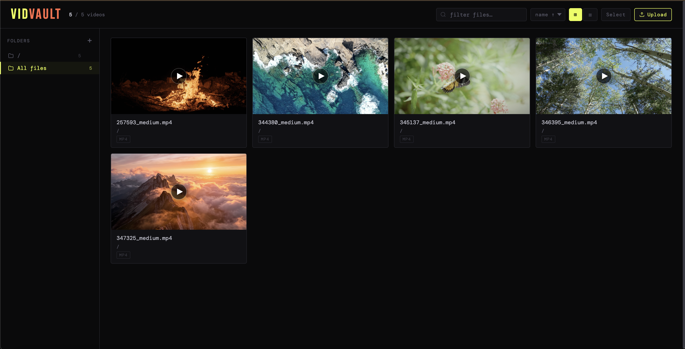

# Vidvault

Local **Go** HTTP server that turns a directory into a **video gallery**: it discovers supported video files, streams them with range requests (so seeking works in the browser), and serves a small web UI for browsing, organizing into folders, bulk selection/move, upload, and lightbox playback. The UI is embedded at compile time from `src/web/`.



**Security:** there is no authentication. Anyone who can reach the listen address can list and stream files under the media root. Use only on trusted networks or `localhost`.

## Requirements

- [Go](https://go.dev/dl/) **1.24.5**+ (see [`go.mod`](go.mod))
- A modern desktop browser (HTML, CSS, and client-side JavaScript)

Optional, for formatting frontend JavaScript:

- [Node.js](https://nodejs.org/) — run `npm install` and `npm run format`

## Run from source

```bash
go build -o vidvault ./src
./vidvault
```

- Serves the **current directory** on port **8765**
- Prints local and LAN URLs and opens the app in your default browser
- Listens on **all interfaces** (`0.0.0.0`) so other devices on your LAN can use the “network” URL

Serve a specific folder and port (**flags first**, then the directory — Go’s `flag` package stops parsing at the first non-flag argument):

```bash
./vidvault -p 9000 /path/to/media
./vidvault -p 9000 ~/Videos
```

### Command-line flags

Arguments are parsed with Go’s standard `flag` package (use `-flag` / `-flag=value`). Put **all flags before** the optional media directory.

| Flag | Default | Description |
| ---- | ------- | ----------- |
| *(positional)* | `.` | Media root directory (optional path **after** all `-…` flags). |
| `-p` | `8765` | TCP port to listen on (`0.0.0.0`). |
| `-d` | off | Enable debug logging. |
| `-disable-browser` | off | Do not open the default browser when the server starts. |
| `-pin` | *(empty)* | Optional PIN: when set, the web UI and APIs stay locked until the PIN is entered. |

Examples:

```bash
./vidvault -p 9000 ~/Videos
./vidvault -d -disable-browser /srv/media
./vidvault -pin 1234 /path/to/media
```

## Run with Docker

The repo includes a multi-stage [`Dockerfile`](Dockerfile) and helper scripts.

**Build only** (defaults: image `vidvault:local`; set `PLATFORM` for `docker build --platform`, e.g. `linux/arm64`):

```bash
./scripts/docker-build.sh
```

| Variable   | Default          | Role |
| ---------- | ---------------- | ---- |
| `IMAGE`    | `vidvault:local` | Image tag passed to `docker build -t`. |
| `PLATFORM` | *(empty)*        | If set, passed as `docker build --platform`. |

**Build and run** (defaults: image `vidvault:local`, host port `8765`, host data directory `./data` → `/data` in the container):

```bash
./scripts/docker-run.sh
```

Override with environment variables:

| Variable  | Default        | Role                                      |
| --------- | -------------- | ----------------------------------------- |
| `IMAGE`   | `vidvault:local` | Docker image name (passed through to `docker-build.sh`) |
| `PLATFORM`| *(empty)*      | If set, `docker build --platform` during the build step |
| `PORT`    | `8765`         | Host port mapped to the container’s `8765` |
| `DATA_DIR`| repo `./data`  | Host directory mounted as media root `/data` |

The image [`docker-entrypoint.sh`](docker-entrypoint.sh) runs before the binary and turns optional **container** environment variables into the same flags as above (truthy values: `1`, `true`, `yes`, `on`, case-insensitive):

| Variable | Maps to |
| -------- | ------- |
| `VIDVAULT_DEBUG` | `-d` |
| `VIDVAULT_DISABLE_BROWSER` | `-disable-browser` |
| `VIDVAULT_PIN` | `-pin` (value from the variable) |

Those are merged **before** the image `CMD` / your `docker run … image …` arguments, so defaults still work, e.g. `CMD` is `-p 8765 /data`.

**Manual example:**

```bash
docker build -t vidvault:local .
docker run --rm -p 8765:8765 -v /path/to/your/videos:/data vidvault:local -p 8765 /data
docker run --rm -p 8765:8765 -v /path/to/your/videos:/data \
  -e VIDVAULT_DISABLE_BROWSER=1 \
  vidvault:local -p 8765 /data
```

The process inside the container listens on port `8765`; map your host port with `-p HOST:8765` if you use something other than `docker-run.sh`.

## Features

| Area         | What you get                                                                 |
| ------------ | ----------------------------------------------------------------------------- |
| **Gallery**  | Grid or list view, search filter, sort by name / folder / extension            |
| **Folders**  | Sidebar; create folders; drag-and-drop onto a folder; delete folder (moves files to root, renames on collision); collapsible section |
| **Tags**     | Sidebar tags with generated colors, per-tag counts, multi-select filtering, and per-video tag assignment |
| **Player**   | Modal lightbox; prev/next and keyboard arrows; streaming with `Accept-Ranges` |
| **Selection**| Select mode, select all / clear, move many files at once                     |
| **Upload**   | Modal upload with optional destination or new folder; server validates video types only |
| **Warnings** | Folders that contain non-video files are flagged (those files are not listed)  |

## Supported video formats

Extensions (case-insensitive): `.webm` `.mp4` `.mpv` `.mkv` `.mov` `.avi` `.m4v` `.ogv`

## HTTP API

All JSON request bodies use `Content-Type: application/json` unless noted.

| Method & path      | Description |
| ------------------ | ----------- |
| `GET /`            | Single-page HTML (embedded assets). |
| `GET /api/videos`  | JSON array of video objects (shape below), including hash and favorite state. |
| `GET /api/favorites` | JSON object mapping `hash -> true` for favorited videos. |
| `POST /api/favorites/set` | Body: `{ "hash": "sha256...", "favorite": true|false }` — explicitly set favorite state for a hash. |
| `GET /api/tags` | JSON object with `tags` and `assignments` (`hash -> [tag_id...]`). |
| `POST /api/tags/create` | Body: `{ "name": "..." }` — create a tag with a generated color. |
| `POST /api/tags/assign` | Body: `{ "hash": "sha256...", "tag_id": "tag_...", "assigned": true|false }` — apply/remove a tag for one video hash. |
| `POST /api/tags/delete` | Body: `{ "tag_id": "tag_..." }` — delete tag and clean assignments. |
| `GET /api/folders` | JSON array of `{ "name": string, "has_other_files": boolean }` — one entry per directory under the root; `name` is the slash-separated path relative to the media root. |
| `POST /api/mkdir`  | Body: `{ "folder": "relative/path" }` — create directory under the media root. |
| `POST /api/rmdir`  | Body: `{ "folder": "relative/path" }` — move files in that folder to the root (rename on conflict), remove the folder tree. |
| `POST /api/move`   | Body: `{ "path": "relative/file.mp4", "dest_folder": "target" }` — `dest_folder` may be `""` or `"/"` for root; creates parents as needed. |
| `POST /api/upload` | `multipart/form-data`: fields `file` (one or more) and `folder` (destination path). Response: JSON array of `{ "name", "error" }` per file (`error` omitted on success). `ParseMultipartForm` limit ≈ 512 MiB. |
| `GET /video?path=…` | Stream a file under the root; `path` is URL-encoded, slash-separated, relative. `403` on path traversal; correct `Content-Type` and range support. |

**`GET /api/videos` item shape:**

```json
{
  "name": "clip.mp4",
  "path": "subfolder/clip.mp4",
  "folder": "subfolder",
  "ext": ".mp4",
  "size": 12345678,
  "modified": "2026-04-28T06:30:00Z",
  "hash": "2d7d4f4b8e3a...",
  "is_favorite": false,
  "tags": ["tag_e319d...."]
}
```

Root-level files use `"folder": "/"`.

Favorites are persisted in your OS config directory under `vidvault/favorites.json`
(resolved via Go's `os.UserConfigDir()`).

Tags are persisted in `vidvault/tags.json` in that same config directory. The file
contains tag definitions (including color) and hash-based tag assignments, so tags
follow file moves/renames.

## Project layout

| Path | Role |
| ---- | ---- |
| [`go.mod`](go.mod) | Go module (`vidvault`). |
| [`Dockerfile`](Dockerfile) | Multi-stage image: Alpine runtime, [`docker-entrypoint.sh`](docker-entrypoint.sh) maps `VIDVAULT_*` env → flags, then `CMD` runs `/vidvault -p 8765 /data`. |
| [`scripts/docker-build.sh`](scripts/docker-build.sh) | `docker build` for a generic local image (`IMAGE`, optional `PLATFORM`). |
| [`scripts/docker-run.sh`](scripts/docker-run.sh) | Calls `docker-build.sh`, then `docker run` with volume and port mapping. |
| [`scripts/docker-build-amd64.sh`](scripts/docker-build-amd64.sh) | `docker buildx` for `linux/amd64` (optional push/load; x86_64). |
| [`scripts/docker-build-arm64.sh`](scripts/docker-build-arm64.sh) | `docker buildx` for `linux/arm64` (optional push/load). |
| [`package.json`](package.json) | `npm run format` — Prettier on `src/web/**/*.js`. |
| `src/main.go` | CLI (`-p`, `-d`, `-disable-browser`, `-pin`), resolve media root, print URLs, optional browser, start server. |
| `src/server.go` | Routes, API handlers, video streaming. |
| `src/video.go` | Supported extensions, `Video` struct, directory walk. |
| `src/template.go` | `embed` of `src/web/*` and single HTML document assembly. |
| `src/browser.go` | LAN IP and OS default browser. |
| `src/web/head.html`, `body.html`, `foot.html` | Page structure. |
| `src/web/styles.css` | Styling. |
| `src/web/app.js` | Client: API calls, UI. |

Rebuilding the binary (`go build -o vidvault ./src`) is required after changing `src/web/` or Go sources—the UI is not read from disk at runtime.

## Development

```bash
go build -o vidvault ./src
./vidvault -p 8765 ./some-test-media
```

Format JavaScript with Prettier:

```bash
npm install
npm run format
```
